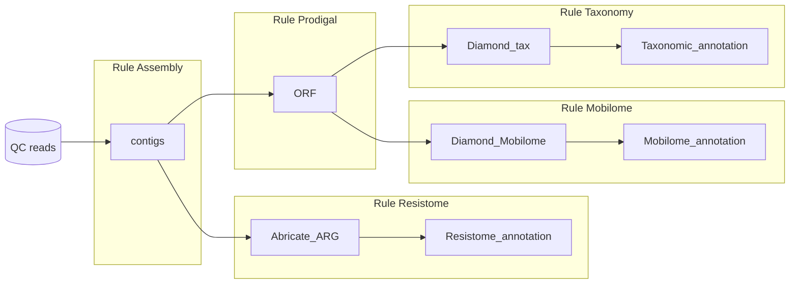

# Resistome_AssemblyBased_Snakemake
 Assembly-based pipeline for the annotation of Antibiotic resistance and mobilome genes.

**Authors**: Ahmed Bargheet, Alise Ponsero, Hanna Noordzij, Ching Jian, Katri Korpela, Mireia Valles-Colomer, Justine Debelius, Alexander Kurilshikov, Veronika K. Pettersen

## Installation and requirements
This pipeline requires the use of Snakemake. 
If not previously installed run the following code: 

```
git clone git@github.com:aponsero/Resistome_AssemblyBased_Snakemake.git
cd Resistome_AssemblyBased_Snakemake

## Snakemake installation in a conda environment
conda env create snakemake_env --file envs/env_snakemake.yml

```

Additionally, custom diamond and Abricate databases should be downloaded.

** Add here Zenodo link to download databases **

## Overview of the pipeline

Below is the overview of the steps included in the pipeline. The pipeline requires reads after quality control and trimming.
The pipeline include 4 steps :
* Assembly of the reads into contigs using Megahit vXXX
* Open reading frame prediction using Prodigal vXXX
* Taxonomy annotation of the contigs using Diamond vXXX
* Resistome annotation of the contigs using Abricate vXXX against the XXX database
* Mobilome annotation of the contigs using Diamond vXXX against the XXX database



## How to run the pipeline
The pipeline expects the inputs to be provided in the "input" folder as paired files ({sample_id}_1.fastq.gz and {sample_id}_2.fastq.gz) and can be run in its entirety by providing the expected final output : {sample_id}__finallog.txt 

As an example, to run the pipeline on the test file (TestPipeline_1.fastq.gz and TestPipeline_2.fastq.gz):

```
# run snakemake
snakemake --cores 8 --use-conda results/TestPipeline_finallog.txt
```

### Expected outputs

The pipeline will generate XX main output files in the results folder:

